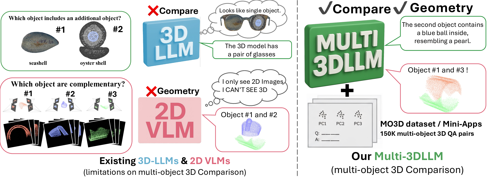

<div align="center">

# Beyond Single Object: Learning 3D Relations with Large Language Models

<p align="center">
  <a href="https://kohsukeide.github.io/BeyondSingleObject/"></a>
  <a href="https://kohsukeide.github.io/BeyondSingleObject/#citation"></a>
  <a href="https://huggingface.co/datasets/idekoh/BeyondSingleObject"></a>
  <a href="https://huggingface.co/idekoh/Multi-3DLLM"></a>
  <a href="#-license"></a>
</p>

[Kohsuke Ide](https://kohsukeide.github.io/), [Ryousuke Yamada](https://ryosuke-yamada.github.io/), [Yue Qiu](https://qiuyue1993.github.io/qiuyue.github.com/), [Xianzheng Ma](https://xianzhengma.github.io/), [Yoshihiro Fukuhara](https://gatheluck.net/), [Hirokatsu Kataoka](https://hirokatsukataoka.net/), [Yutaka Satoh](https://satoh-yutaka.github.io/)

**CVPR 2026 Findings**



</div>

## 📖 Overview

**Beyond Single Object** extends PointLLM-style object-centric 3D-LLMs to relational
reasoning over multiple point clouds. The release includes:

- **MO3D**: multi-object positional, comparative, and holistic QA.
- **Shape Mating**: geometric pair selection with reasoning.
- **Change Captioning**: verification and delta-captioning between shapes.
- **Multi-3DLLM**: a PointLLM-based model with a Patch-Interaction Transformer
  for multi-object point-token interaction.

The public entrypoints are:

```text
scripts/train/train_joint.sh
scripts/eval/infer.sh
scripts/eval/eval_llm.sh
scripts/eval/eval_nlp.sh
scripts/eval/eval_modelnet.sh
```

## 🚀 Getting Started

<details>
<summary><b>📦 Installation</b></summary>

<br>

```bash
git clone https://github.com/KohsukeIde/BeyondSingleObject.git
cd BeyondSingleObject
conda env create -f environment.yml
conda activate beyond-single-object
pip install -e .
```

</details>

<details>
<summary><b>🗂️ Data Preparation</b></summary>

<br>

Download the released annotations and ModelNet40 test file:

```bash
pip install -U "huggingface_hub[cli]"
huggingface-cli download idekoh/BeyondSingleObject \
  --repo-type dataset \
  --local-dir . \
  --include "data/**"
```

Use `huggingface-cli download` or `git lfs`; a plain `git clone` without LFS may
leave large files as pointer stubs.

Then prepare the point-cloud files referenced by the annotations. The expected
layout is:

```text
data/
|-- pointllm/
|   |-- PointLLM_brief_description_660K_filtered.json
|   |-- PointLLM_complex_instruction_70K.json
|   `-- complex_instruction_stage2_multi_pc_70K_gpt.json
|-- mo3d/
|   |-- train.json
|   `-- test.json
|-- shape_mating/
|   |-- train.json
|   `-- test.json
|-- change_captioning/
|   |-- train.json
|   |-- test.json
|   `-- eval_subset.json
|-- modelnet40_data/
|   `-- modelnet40_test_8192pts_fps.dat
`-- point_clouds/
    |-- 8192_npy/
    |-- shapemating/
    `-- scaled_to_align_rendering/
```

Point-cloud sources are not duplicated in the Hugging Face dataset repository.
Create symlinks or copy the point clouds into `data/point_clouds/`:

```bash
mkdir -p data/point_clouds

# Objaverse / PointLLM / MO3D. The source directory contains <object_id>_8192.npy.
ln -s /ABS/PATH/TO/8192_npy data/point_clouds/8192_npy

# Shape Mating. The source directory contains Thingi10K shape-mating point clouds.
ln -s /ABS/PATH/TO/shapemating data/point_clouds/shapemating

# ShapeTalk / Change Captioning. The source directory contains <class>/ShapeNet/<uid>.npz.
ln -s /ABS/PATH/TO/scaled_to_align_rendering data/point_clouds/scaled_to_align_rendering
```

For PointLLM / Objaverse point clouds, download
`Objaverse_660K_8192_npy_split_a*` from
[RunsenXu/PointLLM](https://huggingface.co/datasets/RunsenXu/PointLLM), then:

```bash
cat Objaverse_660K_8192_npy_split_a* > Objaverse_660K_8192_npy.tar.gz
tar -xf Objaverse_660K_8192_npy.tar.gz
```

The ModelNet40 evaluation follows the PointLLM convention and uses
`data/modelnet40_data/modelnet40_test_8192pts_fps.dat` directly. This file is a
PointLLM-compatible Python pickle for `scripts/eval/eval_modelnet.sh`; load it
only from a trusted source.

</details>

<details>
<summary><b>⚖️ Weight Preparation</b></summary>

<br>

Download the released checkpoints:

```bash
huggingface-cli download idekoh/Multi-3DLLM \
  --local-dir checkpoints \
  --include "multi-3dllm/**" "multi-3dllm-classification/**"
```

Expected local layout:

```text
checkpoints/
|-- pointllm-stage1/
|-- multi-3dllm/
`-- multi-3dllm-classification/
```

`multi-3dllm` is used for MO3D, Shape Mating, and Change Captioning.
`multi-3dllm-classification` is used for ModelNet40 classification.
`pointllm-stage1` is the PointLLM stage-1 checkpoint used only when running
joint fine-tuning. To re-run joint fine-tuning, place a compatible PointLLM
initialization checkpoint there, for example:

```bash
huggingface-cli download RunsenXu/PointLLM_7B_v1.1_init \
  --local-dir checkpoints/pointllm-stage1
```

</details>

## 🏋️ Training

<details>
<summary><b>Joint fine-tuning recipe</b></summary>

<br>

Run the default 8-GPU joint fine-tuning recipe:

```bash
MODEL_PATH=checkpoints/pointllm-stage1 \
DATA_PATH=data/point_clouds \
OUTPUT_DIR=outputs/joint \
scripts/train/train_joint.sh
```

The default mixture uses PointLLM caption/instruction data together with MO3D,
Shape Mating, and Change Captioning. To inspect the expanded command without
launching training:

```bash
DRY_RUN=1 scripts/train/train_joint.sh
```

For multi-node training, set `NNODES`, `GPUS_PER_NODE`, `NODE_RANK`, and
`MASTER_ADDR` before running the same script.

</details>

## 🔮 Inference

<details>
<summary><b>MO3D / Shape Mating / Change Captioning</b></summary>

<br>

MO3D:

```bash
MODEL_PATH=checkpoints/multi-3dllm \
ANNO_PATH=data/mo3d/test.json \
DATA_PATH=data/point_clouds \
OUTPUT_DIR=outputs/mo3d_eval \
scripts/eval/infer.sh
```

Shape Mating:

```bash
MODEL_PATH=checkpoints/multi-3dllm \
ANNO_PATH=data/shape_mating/test.json \
DATA_PATH=data/point_clouds \
OUTPUT_DIR=outputs/shape_mating_eval \
SELECT_ONE_MODE=1 \
MULTI_TURN=1 \
scripts/eval/infer.sh
```

Change Captioning:

```bash
MODEL_PATH=checkpoints/multi-3dllm \
ANNO_PATH=data/change_captioning/eval_subset.json \
DATA_PATH=data/point_clouds \
OUTPUT_DIR=outputs/change_captioning_eval_subset \
SCORE_VERIFY_OPTIONS=1 \
MULTI_TURN=1 \
MAX_NEW_TOKENS=96 \
REPETITION_PENALTY=1.15 \
NO_REPEAT_NGRAM_SIZE=5 \
DEDUPE_DELTA_OUTPUT=1 \
MAX_DELTA_OUTPUT_CLAUSES=6 \
scripts/eval/infer.sh
```

The released `data/change_captioning/eval_subset.json` contains a fixed
200-sample LLM-evaluation subset with balanced verification and delta-caption
examples.

</details>

## 📊 Evaluation

<details>
<summary><b>LLM-based metrics, text-overlap metrics, and ModelNet40</b></summary>

<br>

LLM-based metrics use the OpenAI API. The released evaluators use
`gpt-4o-mini-2024-07-18`; record the judge model and date when reporting
numbers.

```bash
export OPENAI_API_KEY=...

TASK=mo3d \
MAX_SAMPLES=300 \
OUTPUT_FILE=outputs/llm_eval/mo3d_subset300.json \
scripts/eval/eval_llm.sh outputs/mo3d_eval/inference.json

TASK=shape_mating \
MAX_SAMPLES=300 \
ANNOTATION=data/shape_mating/test.json \
OUTPUT_FILE=outputs/llm_eval/shape_mating_subset300.json \
scripts/eval/eval_llm.sh outputs/shape_mating_eval/inference.json

TASK=change_captioning \
ANNOTATION=data/change_captioning/eval_subset.json \
OUTPUT_FILE=outputs/llm_eval/change_captioning_eval_subset.json \
scripts/eval/eval_llm.sh outputs/change_captioning_eval_subset/inference.json
```

Metrics:

- MO3D: binary, reasoning, and semantic accuracy.
- Shape Mating: selection accuracy `S` and reasoning accuracy `R`.
- Change Captioning: verification `B/R` and delta-caption `M`. `M` is the raw
  GPT judge average on a 0-10 scale; the metrics JSON also writes `M_percent`
  as `M / 10 * 100` for convenience.
- ModelNet40: CLIP-based zero-shot classification over 40 class names.

Supplemental text-overlap metrics:

```bash
TASK=mo3d scripts/eval/eval_nlp.sh outputs/mo3d_eval/inference.json
TASK=shape_mating ANNO_PATH=data/shape_mating/test.json scripts/eval/eval_nlp.sh outputs/shape_mating_eval/inference.json
TASK=change_captioning scripts/eval/eval_nlp.sh outputs/change_captioning_eval_subset/inference.json
```

ModelNet40 classification:

```bash
MODEL_PATH=checkpoints/multi-3dllm-classification \
OUTPUT_DIR=outputs/modelnet40_eval \
LIMIT=0 \
PROMPT_MODE=paper \
NUM_OBJECTS=1 \
TARGET_POSITION=1 \
scripts/eval/eval_modelnet.sh
```

Repeat `(NUM_OBJECTS, TARGET_POSITION) = (1,1), (2,1), (2,2), (3,1), (3,2),
(3,3)` for the full table.

</details>

## 🔗 Citation

If you find our work useful, please consider citing:

```bibtex
@inproceedings{ide2026beyondsingleobject,
  title={Beyond Single Object: Learning 3D Relations with Large Language Models},
  author={Ide, Kohsuke and Yamada, Ryousuke and Qiu, Yue and Ma, Xianzheng and Fukuhara, Yoshihiro and Kataoka, Hirokatsu and Satoh, Yutaka},
  booktitle={Proceedings of the IEEE/CVF Conference on Computer Vision and Pattern Recognition (CVPR) Findings},
  year={2026}
}
```

## 👏 Acknowledgements

This project builds on the following excellent works:

- [PointLLM](https://github.com/InternRobotics/PointLLM): our codebase and Multi-3DLLM are built upon PointLLM.
- [Point-BERT](https://github.com/lulutang0608/Point-BERT): point-cloud transformer backbone.
- [Vicuna](https://github.com/lm-sys/FastChat): the LLM backbone used by PointLLM.
- [Objaverse](https://objaverse.allenai.org) / [Cap3D](https://github.com/crockwell/Cap3D): 3D assets and captions used to build MO3D.
- [ShapeTalk / ChangeIt3D](https://changeit3d.github.io/): source shapes and language for Change Captioning.
- [Thingi10K](https://ten-thousand-models.appspot.com/): meshes used for Shape Mating.
- [Neural Shape Mating](https://neural-shape-mating.github.io/): the pairwise shape-mating formulation.

## 📄 License

Newly authored code is released under Apache-2.0 unless noted otherwise.
Components, annotations, checkpoints, and datasets derived from upstream
projects retain their original licenses and terms.
